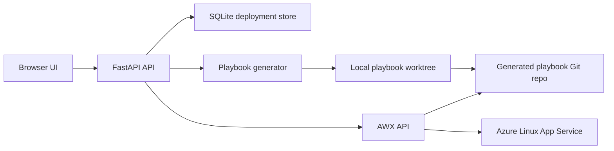

# Azure AWX Ansible Deployer

Ansible App is a FastAPI-based deployment automation project for Azure Linux App Service. It takes a web app deployment request from a browser form, generates an Ansible playbook, stores deployment state locally, pushes the playbook to a Git repository, synchronizes that repository with AWX, creates an AWX Job Template, and launches the deployment job.

The project is designed as a DevOps portfolio app that demonstrates how FastAPI, Git, Ansible, AWX, and Azure can work together in one deployment flow.

## Architecture



## What Is Included

- Browser form for creating Azure Web App deployment configurations.
- FastAPI backend with deployment-centered API endpoints.
- SQLite persistence for deployment records and status tracking.
- Dynamic Ansible playbook generation for Python and Node.js Linux Web Apps.
- Git integration for a separate generated-playbook repository.
- Secure Git authentication through temporary `GIT_ASKPASS`, without storing the GitHub token in the Git remote URL.
- AWX API integration for credential lookup, shared Project sync, Job Template creation, job launch, and status refresh.
- AWX Azure credential attachment, so Azure secrets are not sent in AWX `extra_vars`.
- Safer frontend rendering using DOM APIs instead of `innerHTML`.
- Input validation for app names, repository URLs, branches, regions, resource groups, and startup files.
- Basic tests for security-sensitive behavior.

## Supported Deployment Targets

Current target:

```text
Azure Linux App Service
```

Current app types:

```text
Python web apps
Node.js web apps
```

Python apps are generated with a Gunicorn startup command. Node.js apps use either a provided entry file or `npm start`.

Azure App Service build settings are enabled in the generated playbooks:

```text
SCM_DO_BUILD_DURING_DEPLOYMENT=true
ENABLE_ORYX_BUILD=true
```

This lets Azure/Oryx install dependencies from files such as `requirements.txt` or `package.json`, depending on the application repository.

## Repository Separation

This repository contains the deployment platform:

```text
FastAPI app
frontend
playbook generator
AWX integration
tests
```

Generated deployment playbooks are pushed to a separate Git repository configured by:

```env
GIT_REPO=github.com/your-github-username/ansible-playbooks.git
```

AWX reads that generated-playbook repository as its SCM Project source.

## Requirements

- Python 3.11+
- Git
- AWX reachable from the machine running FastAPI
- AWX API token
- AWX Source Control credential for the playbook Git repo
- AWX Microsoft Azure Resource Manager credential
- Azure subscription and service principal for real deployments

Install Python dependencies:

```bash
pip install -r requirements.txt
```

## Environment Configuration

Copy the example file:

```bash
cp .env.example .env
```

Then fill in:

```env
AWX_URL=http://localhost:8888
AWX_TOKEN=replace-with-awx-token
AWX_PROJECT_NAME=azure-generated-playbooks
AWX_AZURE_CREDENTIAL_NAME=azure-service-principal
AWX_SCM_CREDENTIAL_NAME=github-ansible-playbooks
AWX_INVENTORY_ID=1

GIT_REPO=github.com/your-github-username/ansible-playbooks.git
GIT_BRANCH=main
GIT_TOKEN=replace-with-fine-grained-github-token
PLAYBOOK_WORKTREE=.runtime/ansible-playbooks

AZURE_SUBSCRIPTION_ID=replace-with-subscription-id
AZURE_CLIENT_ID=replace-with-client-id
AZURE_SECRET=replace-with-client-secret
AZURE_TENANT=replace-with-tenant-id
```

Optional AWX timeout settings:

```env
AWX_REQUEST_TIMEOUT=30
AWX_SYNC_ATTEMPTS=120
```

Do not commit `.env`. It is ignored by `.gitignore`.

## AWX Setup

Create a Source Control credential for the generated-playbook repository.

Recommended name:

```text
github-ansible-playbooks
```

For GitHub token authentication:

```text
Username: x-access-token
Password: your GitHub token
```

Create or allow the app to create a shared AWX Project:

```text
Name: azure-generated-playbooks
SCM Type: Git
SCM URL: https://github.com/OWNER/ansible-playbooks.git
SCM Branch: main
SCM Credential: github-ansible-playbooks
Update Revision on Launch: enabled
```

Create an Azure credential in AWX:

```text
Name: azure-service-principal
Type: Microsoft Azure Resource Manager
```

Fill:

```text
Subscription ID
Client ID
Client Secret
Tenant ID
```

The app looks up this credential by name and attaches it to each generated Job Template.

## Running Locally

Start the FastAPI app:

```bash
python -m uvicorn main:app --host 127.0.0.1 --port 8000
```

Open:

```text
http://127.0.0.1:8000
```

If AWX is running in Kubernetes and exposed through port-forwarding, keep the port-forward terminal open while using the app.

Example:

```bash
kubectl port-forward --address 127.0.0.1 svc/<awx-service-name> 8888:8052
```

## Deployment Flow

1. User fills the browser form.
2. FastAPI validates the request.
3. A deployment record is created in SQLite.
4. A Python or Node.js Ansible playbook is generated.
5. The playbook is written into the generated-playbook Git worktree.
6. Git commits and pushes the playbook to the configured repository.
7. FastAPI creates or updates the shared AWX Project.
8. FastAPI triggers an AWX Project sync and waits for it to finish.
9. FastAPI creates an AWX Job Template for the generated playbook.
10. User launches the deployment.
11. FastAPI launches the AWX job.
12. User can refresh job status from the UI.

## API Endpoints

Main endpoints:

```text
GET  /
GET  /api/regions/{app_type}
GET  /api/languages

POST /api/formulaire
POST /api/deployments
GET  /api/deployments
GET  /api/deployments/{deployment_id}

POST /api/deployments/{deployment_id}/launch
GET  /api/deployments/{deployment_id}/refresh
```

There is also a legacy AWX launch endpoint:

```text
POST /api/launch-job/{job_template_id}
```

For safer usage, prefer deployment IDs through `/api/deployments/{deployment_id}/launch`.

## Security Notes

- `.env` is ignored and must not be committed.
- Azure secrets are not sent in AWX `extra_vars`.
- The AWX Job Template references the AWX Azure credential.
- GitHub tokens are passed to Git through temporary `GIT_ASKPASS`.
- The Git remote URL remains token-free.
- Generated playbooks mark Azure token tasks with `no_log: true`.
- The frontend avoids unsafe `innerHTML` rendering for user-controlled values.

After demos or debugging, rotate exposed GitHub, AWX, and Azure secrets if they were displayed in a terminal, screen share, or chat.

## Tests

Run the current tests with:

```bash
python -m unittest discover -s tests
```

The tests currently cover:

- valid and invalid form payloads
- app-name/path traversal protection
- AWX Job Template payload not containing Azure secrets
- shared AWX Project payload creation
- SQLite deployment persistence
- deployment launch/status refresh behavior

## Planned Improvements

The current version demonstrates the complete deployment orchestration flow. Planned improvements include:

- stable Azure resource names for easier redeployments;
- unique playbook filenames per deployment;
- framework-specific startup handling for Flask, Django, and FastAPI;
- playbook syntax validation before pushing to Git;
- final application health checks after AWX job success;
- CI checks with GitHub Actions.

## Suggested Demo Repository

Python Flask sample:

```text
https://github.com/Azure-Samples/msdocs-python-flask-webapp-quickstart
```

Use:

```text
Language: Python
Branch: main
Python version: 3.11
Startup file: app:app
```

## Project Status

The current implementation demonstrates the full orchestration path up to AWX job execution:

```text
Browser -> FastAPI -> SQLite -> generated Ansible playbook -> GitHub -> AWX -> Azure App Service
```

For real Azure deployments, the AWX Azure credential must point to an active Azure subscription and a service principal with sufficient permissions.
